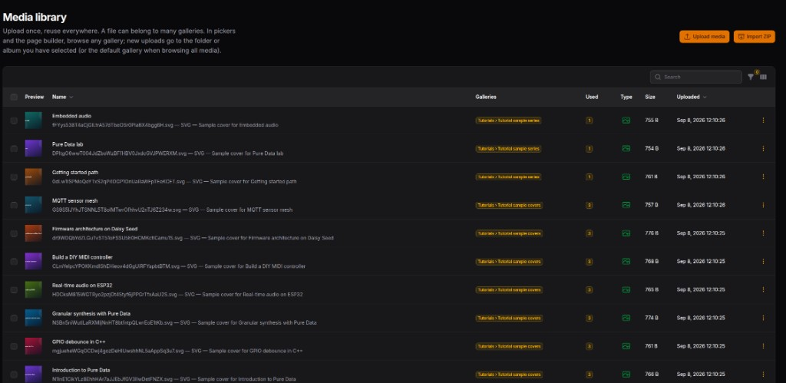
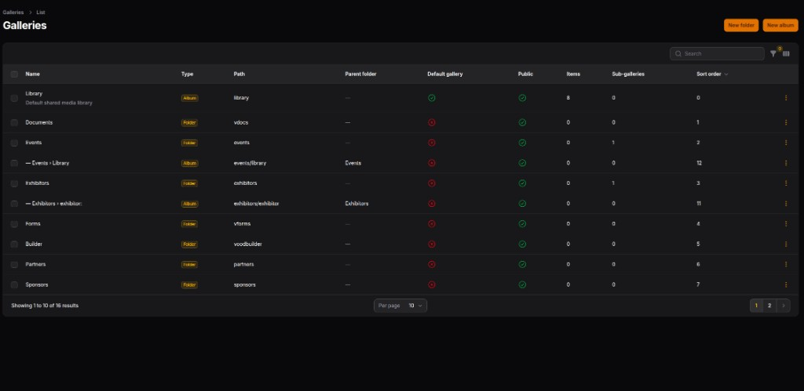
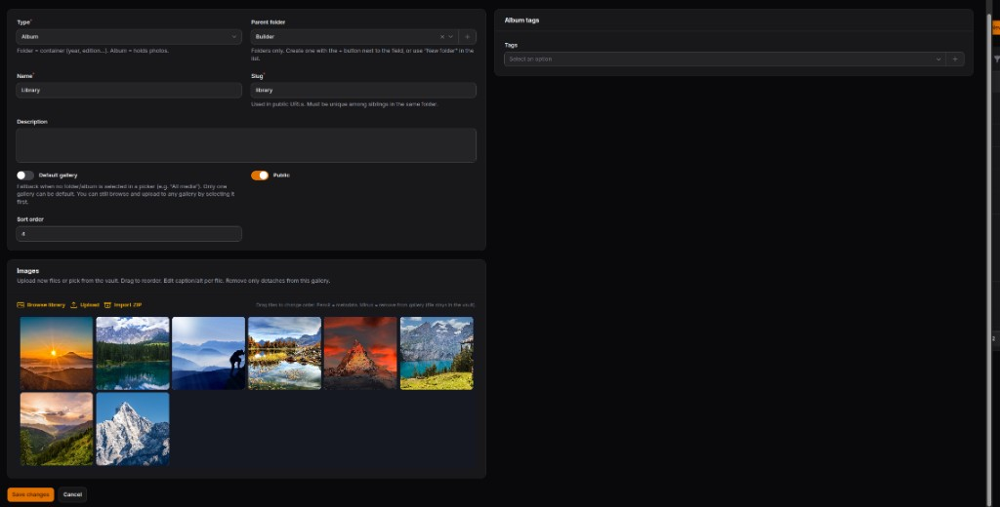
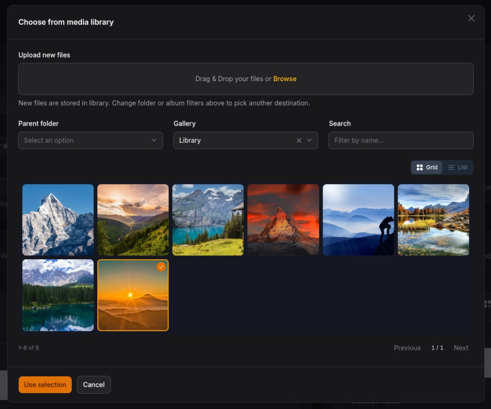

# VoodMedia (`voodflow/vmedia`)

**Media Vault** for the Voodflow plugin family: upload once, reuse everywhere. One vault storage copy, many gallery memberships, morph attachments for your domain models.

Built on Filament 5 and [Spatie Media Library](https://github.com/spatie/laravel-medialibrary). Works **standalone** (admin + HTTP API + public galleries). Integrates with VoodBuilder Asset Manager and Voodflow (e.g. Approval Page heroes).

## Screenshots

### Media library

Central library: preview, galleries, **usage** counts, type, size, and upload time. Upload media or **Import ZIP** from the header.



### Galleries (folders & albums)

Organize vault media with a hierarchy: **Folder** = container (year, product, plugin…); **Album** = holds photos/files. Mark a **default gallery** and toggle **public** albums.



### Album editor

Edit album metadata (parent, slug, public/default), manage images (browse library, upload, ZIP import, drag reorder), and assign **album tags**.



### Picker (`VmediaPicker`)

Modal for forms and builders: upload into the selected folder/album, filter by parent/gallery, search, grid/list view, multi-select → **Use selection**.



## Requirements

| Requirement | Notes |
|-------------|--------|
| PHP | 8.4+ |
| Laravel | 12 or 13 |
| Filament | 5 |
| Spatie Media Library | 11 |
| PHP `gd` extension | **Must** be built with **JPEG** (and preferably **WebP** + FreeType). Spatie generates `thumb` conversions on upload; without JPEG support you get `imagecreatefromstring(): No JPEG support in this PHP build`. |

Verify in the app container:

```bash
php -r 'var_export(gd_info()["JPEG Support"] ?? false);'
# expect: true
```

Docker / `php:*-fpm` example:

```dockerfile
RUN apt-get update && apt-get install -y \
    libpng-dev libjpeg-dev libwebp-dev libfreetype6-dev \
    && docker-php-ext-configure gd --with-freetype --with-jpeg --with-webp \
    && docker-php-ext-install gd
```

## Quick start (5 minutes)

```bash
composer require voodflow/vmedia
php artisan vmedia:install
```

Register on the Filament panel:

```php
->plugins([
    \Voodflow\Vmedia\VmediaPlugin::make(),
])
```

Attach media to a model:

```php
use Voodflow\Vmedia\Concerns\HasAttachedMedia;

class Booth extends Model
{
    use HasAttachedMedia;
}
```

Upload in a Filament form:

```php
use Voodflow\Vmedia\Filament\Forms\Components\VmediaFileUpload;

VmediaFileUpload::make('logo')
    ->collection('logo')
    ->image();
```

Pick existing vault media:

```php
use Voodflow\Vmedia\Filament\Forms\Components\VmediaPicker;

VmediaPicker::make('gallery')
    ->collection('gallery')
    ->images()
    ->multiple();
```

## Model

- **Vault** — singleton Spatie owner of every file on disk (one storage copy)
- **Galleries** — many-to-many membership (a photo/video/file can sit in several galleries)
- **Folders vs albums** — folders nest structure; albums hold media
- **Default gallery** — fallback target for uploads when no gallery is selected; Choose can browse any gallery
- **Attachments** — `HasAttachedMedia` morph pivot (domain models never own Spatie collections)

## Features

| Area | What you get |
|------|----------------|
| Admin | Library + galleries hierarchy, metadata (alt, caption, credits; video poster on videos), soft delete / trash |
| Picker | `VmediaPicker` + `VmediaFileUpload` for other plugins |
| Files | Photos, videos, and documents (PDF/Office/ZIP…) |
| Thumbs | Spatie `thumb` conversion (WebP) for images |
| Usage | Attachment counts; delete protected when media is in use |
| Tags | Media tags + album tags; bulk assign |
| Duplicates | SHA-256 reuse (optional) |
| ZIP import | Bulk extract into the vault |
| Events | `MediaStored`, `MediaAttached`, `MediaDetached`, `MediaDeleted`, `MediaRestored` |
| Stats | Dashboard widget + `php artisan vmedia:stats` |
| Orphans | `php artisan vmedia:prune-orphans --force` |
| Public | `GET /galleries/{slug}` Blade gallery for `is_public` galleries |

## HTTP API (package-owned)

| Method | Path | Role |
|--------|------|------|
| `GET` | `/vmedia/media/galleries` | Gallery list + counts |
| `GET` | `/vmedia/media?page=&per_page=&gallery_id=&type=&q=` | Paginated assets (`type`: image\|video\|file) |
| `POST` | `/vmedia/media/upload` | Upload; optional `gallery_id` (folder/album — folders resolve to library album) |
| `DELETE` | `/vmedia/media/{media}` | Soft-delete (`?force=1` force-deletes) |

All routes require authentication (and optional Gate ability `VMEDIA_ABILITY`).

## Config highlights

```env
VMEDIA_ENABLED=true
VMEDIA_DISK=public
VMEDIA_CONVERSIONS=true
VMEDIA_DETECT_DUPLICATES=true
VMEDIA_PROTECT_DELETE=true
VMEDIA_PUBLIC_GALLERIES=true
VMEDIA_VOODBUILDER_EDITOR_ROUTES=true
```

## Docs

- User manual: [docs/manual/user/index.md](docs/manual/user/index.md)
- Developer manual: [docs/manual/developer/index.md](docs/manual/developer/index.md)
- Product overview: [docs/sales/README.md](docs/sales/README.md)

## License

MIT — see [LICENSE](LICENSE).
